# DMRPC
This is the source code of Data-driven Model Predictive Control (DMRPC).

LSTM训练记录 一定要使用doubleTensor来训练，否则经过归一化之后，精度会出问题
|  训练次数   | 验证集精度  |   训练集精度(与机理模型做对比)    |
|  :----:  | :----:  |  :----:    |
| 600次训练  | 0.00000024  |    5.94e-5 |
| 700次训练  | 0.00000027 |     7.28e-5|
| 800次训练 |  0.00000017    |  7.28e-5|
|900次训练 |  0.00000015  | 3.375e-5|
|1000次训练|  0.00000010  |  3.017e-5|
|1100次训练 | 0.00000015  | 3.017e-5|
|1200次训练 | 0.00000016 |  2.948e-5|
|1300次训练    |  0.00000009|    2.013e-5|
|1400次训练    |  0.00000010  |  2.103e-5|
|1500次训练    |  0.00000007  |  1.154e-5|
|1600次训练    |  0.00000006  |  1.160e-5|
|1700次训练    |  0.00000010  |  1.835e-5|
|1800次训练    |  0.00000004  |  1.1212e-5|
|1900次训练    |  0.00000011  |  2.16e-5|
|2000次训练    |  0.00000005  |  1.64e-5|
|2100次训练    |  0.00000008  |  2.546e-5| 
 
不同的训练次数最终结果差不多，主要影响因素在与归一化后的值。Pytorch使用中，如果使用float32作为默认精度，使用前向差分计算梯度的时候，会出现归一化数据之后，有无前向差分项的归一化后的数值是一样的。所以，后期一定要确认使用float64来作为默认数据精度。

# LMPC framework
$\begin{array}{ll}\mathcal{J}= & \max _{u \in S(\Delta)} \int_{t_{k}}^{t_{k+N}} l(\tilde{x}(t), u(t)) d t \\ \text { s.t. } & \dot{\tilde{x}}(t)=f_{nn}(\tilde{x}(t), u(t)) \\ & u(t) \in U, \quad \forall t \in\left[t_{k}, t_{k+N}\right) \\ & \tilde{x}\left(t_{k}\right)=\bar{x}\left(t_{k}\right) \\ & V(\tilde{x}(t)) \leq \rho_{e}, \quad \forall t \in\left[t_{k}, t_{k+N}\right) \\ & \text { if } \bar{x}\left(t_{k}\right) \in \Omega_{\rho_{e}} \\ & \dot{V}\left(\bar{x}\left(t_{k}\right), u\right) \leq \dot{V}\left(\bar{x}\left(t_{k}\right), \phi\left(\bar{x}\left(t_{k}\right)\right)\right. \\ & \text { if } \bar{x}\left(t_{k}\right) \in \Omega_{\rho} \backslash \Omega_{\rho_{e}}\end{array}$

where $l(\tilde{x}(t), u(t)) = \int_{t_{k}}^{t_{k+N}}(x(t)^TQx(t) + u(t)^TRu(t)$), $Q$ and $R$ are hyperparameters which are required to tune. $f_{nn}$ is the predictive model of model predictive control (MPC), it is a black-box model and it is trained with large historical data.

# No attack, model test
## Experiments about the First Principle model
To test that the LMPC framework works in these experiments

    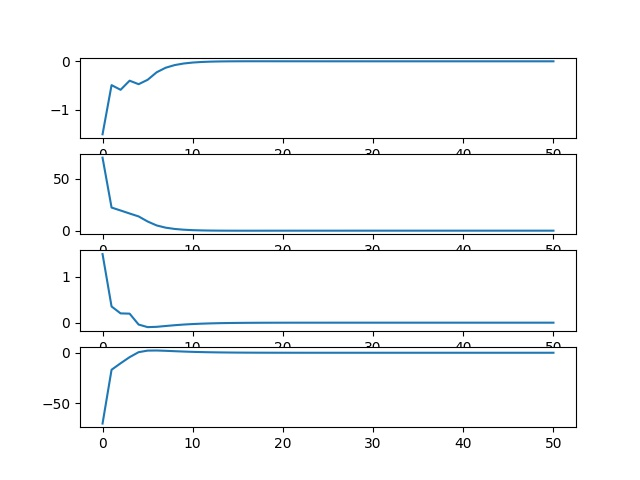
     
    
System track using First Principle

    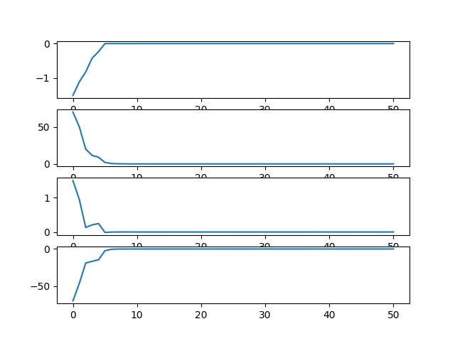
     
    
System track using First Principle by using approximate gradient

## Experiments about Data-driven model

    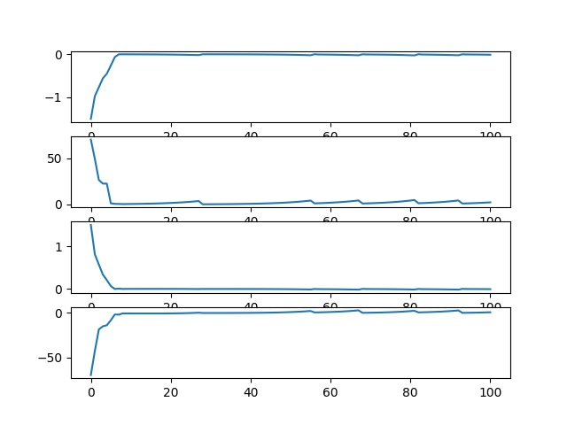
     
    
System track using LSTM by using real sensor value from plant

    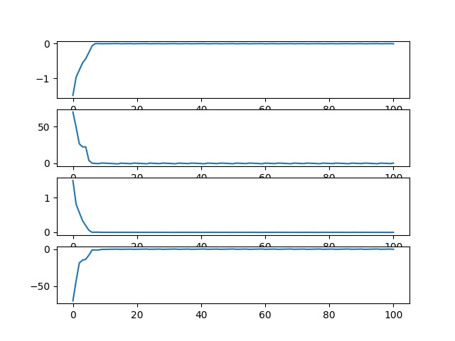
     
    
System track using LSTM by using Digital Twin value to calculate control quantity

# Experiments about Attacks
## Min-max Attacks
$\bar{x}\left(t_{i}\right)=\min \left\{\underset{x \in R^{n x}}{\operatorname{argmax}}\left\{V\left(x\left(t_{i}\right)\right) \leq \rho\right\}, \underset{x \in \mathbb{R}^{n_{x}^{n}}}{\operatorname{argmax}}\left\{x\left(t_{i}\right) \in \chi\right\}\right\}, \forall i \in\left[i_{0}, i_{0}+L_{a}\right]$

Attack starts from $i_0$, and stop after $L_a$ time points. It wishes to make the state far away from system stable point but keep the state in the bound and the stable range. $rho$ is the level set of the Lyapunov function $V(x)$ that characterizes the stability region of the closed-loop system.

    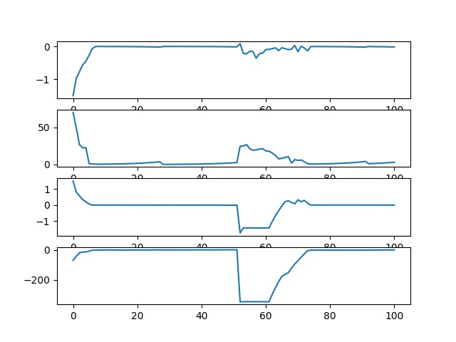
     
    
Min-max Attacks, range:50-60, No resilient control

    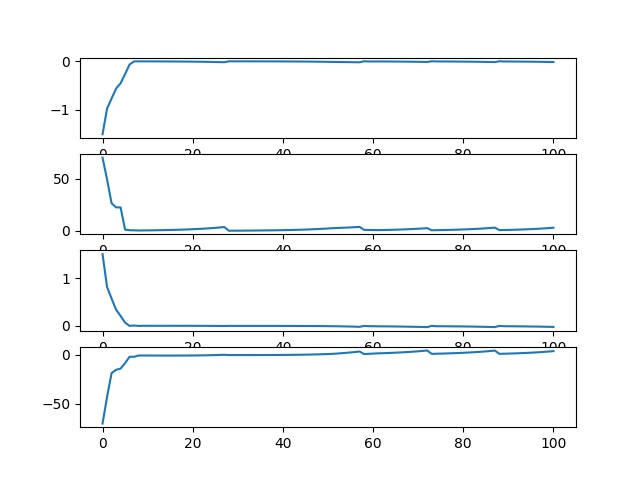
     
    
Min-max Attacks, range:50-60, Resilient control to maintain the control process

## Geometric Attacks
$\bar{x}\left(t_{i}\right)=x\left(t_{i}\right)+\beta \times(1+\alpha)^{i-i_{0}}, \forall i \in\left[i_{0}, i_{0}+L_{a}\right]$

Attacks start from $i_0$, and stop after $L_a$ time points. 
It wishes to deteriorate the closed-loop system stability 
slowly at the beginning, then geometrically increase its impacts as time progresses, with its maximum damage achieved at the end of
the attack duration.

This attack is difficult to detect **at first few steps**.

    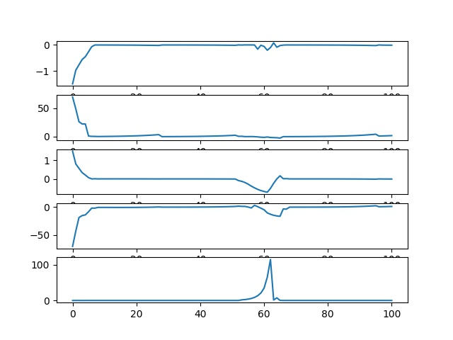
     
    
Geometric Attacks, range:50-60, No resilient control

    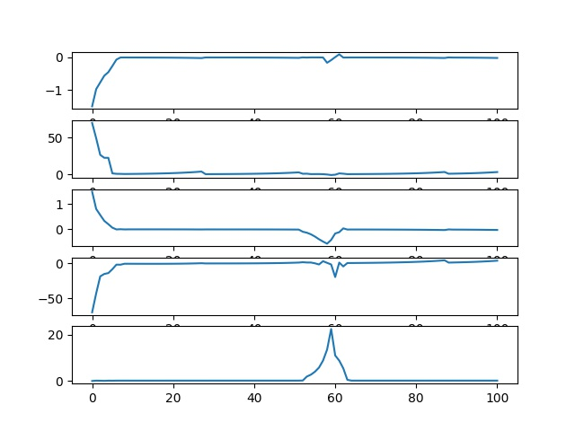
     
    
Geometric Attacks, range:50-60, Using resilient control,
    No roll-back strategy 

    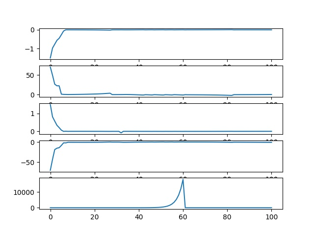
     
    
Geometric Attacks, range:50-60, Resilient control,
    Using roll-back strategy

## Surge Attacks

Surge attacks act similarly like min-max attacks initially to maximize the
disruptive impact for a short period of time, then they are reduced to
a lower value. In our case, the duration of the initial surge in terms of
sampling times is selected as $L_s [2,5]$ to differentiate itself from a
min-max attack. Moreover, the initial surge period $L_s$ is chosen to be
in this range such that the potential time delays on the detection
alarm will not be longer than $L_s$ where the impact is most severe, and
in turn, may cause a missed alarm from the detector. After the initial
surge, the reduced constant value—at which the attack stays, is
chosen considering the impact of the initial surge and the total duration
of the attack such that the cumulative error between state measurements
and their steady state values will not exceed the threshold
defined in some statistic-based detection methods (e.g., CUSUM).The
formulation of a surge attack is presented below:

$\bar{x}\left(t_{i}\right)=\min \left\{\underset{x \in R^{n x}}{\operatorname{argmax}}\left\{V\left(x\left(t_{i}\right)\right) \leq \rho\right\} \underset{x \in R^{n^{x}}}{\operatorname{argmax}}\left\{x\left(t_{i}\right) \in \chi\right\}\right\}$, if $i_{0} \leq i \leq i_{0}+L_{s}$
$\bar{x}\left(t_{i}\right)=\underset{x \in R^{n x}}{\arg \max }\left\{\left|x\left(t_{i}\right)\right|, 0 \leq i \leq i_{0}\right\}$, if $i_{0}+L_{s}<i \leq i_{0}+L_{a}$

where $i_0$  is the start time of the attack, $L_s$ is the duration of the initial
surge, and $L_a$ is the total duration of the attack in terms of sampling
periods. After the initial surge, the attack is reduced to a lower constant
value, which is obtained by examining the secure state measurements
prior to the occurrence of the surge attack, and taking the
value that is furthest away from the origin.

    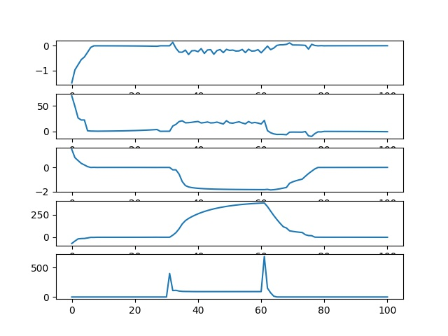
     
    
Surge Attacks, range:30-60, No resilient control

    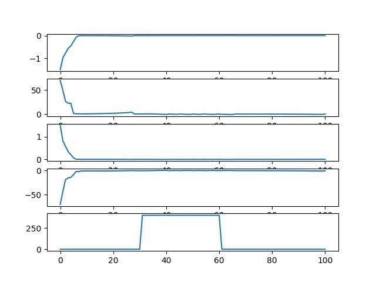
     
    
Surge Attacks, range:30-60, Resilient control,
    Using roll back strategy.

